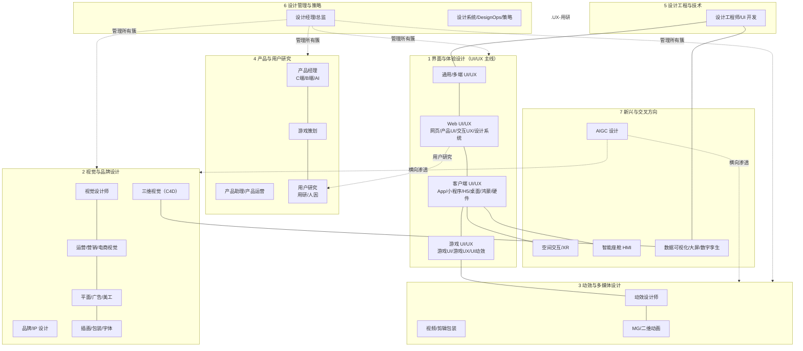

# UI / 设计 / 产品方向岗位全景（2025-2026 调研）

> 版本：2026-08-15
> 用途：对应 `steps/README.md` 第二学期「面向真实岗位」部分，作为岗位调研的分层资料库；后续整合进学习方案时可直接引用本目录文件。
> 调研方法：以百度、360 搜索为主，交叉检索牛客网、BOSS直聘、猎聘、智联、职友集、国家大学生就业服务平台、应届生求职网等平台的真实 JD（招聘快照时间集中在 2025-2026）。所有样本均来自可追溯的搜索快照或页面原文，摘要截断处标注「（截断）」，未编造内容。
> 使用提醒：岗位状态、届别与截止时间动态变化，实际投递务必回各公司官网二次确认；薪资区间来自快照样本，仅作量级参考。
> 范围说明：游戏美术（原画/特效/动作/模型/TA 等）由 Unity 组负责培养，不在本目录范围内；「无障碍」并入第二学期「职业化初步」通用能力，不单列岗位。

## 1. 为什么做这份全景

`steps/README.md` 第二学期最初只列了「Web UI/UX、客户端 UI/UX、游戏 UI/UX、产品经理」四个方向。这不是岗位的全部，而是早期规划中的锚点。本目录用真实 JD 调研出 UI/设计/产品方向的完整岗位版图，并**按相似关系分层**，让学习者可以看到：

- 四个锚点岗位在整个版图中的位置与相邻岗位；
- 从锚点岗位可以向哪些方向迁移、需要补齐什么；
- 哪些岗位簇目前招人最多、哪些是新兴方向。

## 2. 顶层分类：7 大岗位簇

按工作产出物、能力结构与协作对象的相似度，将调研到的全部岗位（游戏美术除外，Unity 组负责）划为 7 个簇：

```text
1. 界面与体验设计（UI/UX 主线，按场景合并）  ← 原第二学期四个锚点中的三个在这里
2. 视觉与品牌设计
3. 动效与多媒体设计
4. 产品与用户研究                          ← 产品经理锚点在这里
5. 设计工程与技术
6. 设计管理与策略
7. 新兴与交叉方向
```

### 2.1 岗位地图（树形）

```text
1. 界面与体验设计（UI/UX 主线，UI 与 UX 按场景合并）
├── 通用 / 多端 UI/UX 设计师（多端/全终端 UI、UI 视觉、B 端 UI）
├── Web UI/UX（产品设计与视觉合并）
│   ├── 网页设计师（官网/落地页/专题页）
│   ├── Web 产品 UI（SaaS/B 端后台/管理系统）
│   ├── 交互/UX（交互设计师、UX/体验设计师、产品体验设计师）
│   └── 设计系统/组件库方向（多为 UI 岗内嵌职能）
├── 客户端 UI/UX
│   ├── 移动端 App UI（iOS/Android 双端）
│   ├── 小程序 / H5 UI
│   ├── 桌面客户端 UI
│   ├── 鸿蒙原生 UI（新兴）
│   └── 智能硬件 / 嵌入式界面 UI
├── 游戏 UI/UX
│   ├── 游戏 UI 设计师（HUD/系统界面/图标/字体）
│   ├── 游戏 UX / 社区产品 UX（深度玩家偏好）
│   └── 游戏 UI 动效设计师（Unity/UE 落地）
└── UI 动效设计师（AE/Rive/Lottie 交付，与 03 簇交叉）
（无障碍：不单列岗位，并入第二学期「职业化初步」通用能力）

2. 视觉与品牌设计
├── 视觉设计师（产品视觉/大厂通用视觉岗）
├── 品牌设计（品牌设计师、VI、品牌视觉）
├── IP 设计（IP 设计师、IP 图库、表情包）
├── 运营与营销设计（运营设计师、营销视觉、活动 KV、大促视觉）
├── 电商视觉设计（电商设计师、电商美工、AIGC 电商）
├── 平面与广告设计（平面设计师、广告创意设计师、美工）
├── 专项视觉（插画师、包装设计师、字体设计师）
└── 三维视觉设计（C4D/3D 视觉、游戏品宣 3D 视觉）

3. 动效与多媒体设计
├── 动效设计师（通用/影视包装向，AE 主线）
├── UI/交互动效设计师（AE/Spine/Rive，与 1.5 交叉）
├── 游戏 UI 动效（与 1.4 交叉；角色/技能动效归游戏美术）
├── 三维视觉/三维动效（C4D/Blender 主线）
├── 视频设计师 / 剪辑包装师
├── MG 动画师 / 二维动画师（Spine/Live2D 与游戏美术交叉，游戏美术由 Unity 组负责）
└── 多媒体设计师

4. 产品与用户研究
├── 产品经理
│   ├── C 端产品经理 / B 端产品经理
│   ├── AI 产品经理（大模型落地，新兴高热度）
│   └── 按领域：云计算/智能硬件配套软件/游戏平台/增长等
├── 产品助理 / 助理产品经理
├── 产品运营（内容运营/增长运营，相邻岗）
├── 游戏策划（系统/数值/关卡/文案/战斗，相邻岗）
└── 用户研究
    ├── 用户研究员（UX Researcher）
    ├── 用户研究工程师（偏硬科技）
    └── 人因工程/生理测量用研（眼动/脑电，新兴）

5. 设计工程与技术
├── 设计工程师 / UI 开发工程师（大陆多称 UI 开发/前端，独立岗名少）
├── 创意技术（Creative Technologist，大陆几乎无独立岗位）
└── 可视化工程（前端/Three.js，与 07 簇交叉）

6. 设计管理与策略
├── 设计经理 / 设计组长
├── 设计总监 / 设计负责人
├── 设计系统负责人 / DesignOps（多为内嵌职能，独立岗少）
└── 设计策略师 / 前沿策略设计师（汽车/硬件行业）

7. 新兴与交叉方向
├── AIGC 设计（AIGC 设计师、AI 视觉设计师、AI 生图/视频，2025-2026 热度最高）
├── 空间交互 / XR（XR 交互设计师、VR 设计师；「3D UI/空间计算」大陆无独立岗名）
├── 智能座舱 HMI（HMI 视觉/交互/动效/3D，主机厂与供应链需求旺）
├── 数据可视化 / 大屏设计（可视化设计师、大屏 UI）
└── 数字孪生设计（工业/政企，3D 建模与场景搭建）
```

### 2.2 岗位地图（mermaid）



## 3. 原第二学期四个锚点与岗位全景的映射

| 原第二学期锚点 | 本目录位置 | 相邻/可迁移岗位（调研新增） |
|---|---|---|
| Web UI/UX | 簇 1（界面与体验设计） | 通用/多端 UI、B 端 UI、设计系统、UI 动效、视觉设计、数据可视化 |
| 客户端 UI/UX | 簇 1 | App UI、鸿蒙 UI、智能硬件 UI、智能座舱 HMI、UI 动效 |
| 游戏 UI/UX | 簇 1（游戏美术由 Unity 组负责） | 游戏 UX、游戏 UI 动效、游戏动效（Unity 组）、美术 PM（Unity 组） |
| 产品经理 | 簇 4（产品与用户研究） | 产品助理、产品运营、游戏策划、用户研究、AI 产品经理 |

## 4. 簇间相似关系说明（供学习路线设计参考）

- **簇 1 是中枢**：其余各簇通过「视觉执行」「动效」「研究」「工程」「管理」与其相接，是设计专业学生的主战场，也是原四个锚点中三个的所在。
- **UI 动效是桥**：同时属于 UI 工作流与簇 3，软件栈 AE/Spine/Rive；游戏 UI 动效还需 Unity/UE 落地能力。
- **视觉与运营设计横跨互联网与实体行业**：电商/AIGC 电商、包装、IP 等岗位大量存在于非互联网公司，是设计学生就业的基本盘之一。
- **AIGC 不是独立簇，而是横向渗透**：已作为硬技能出现在几乎每个簇的新 JD 中（AIGC 设计师、AIGC 电商、AI 视觉、AI 生图/视频），但独立岗位的要求仍建立在对应簇的传统基本功之上。
- **产品簇对设计背景最友好的入口**：产品助理、AI 产品经理（会用 v0/Lovable/Cursor 做原型）、游戏策划（重视体验与同理心），JD 明确欢迎设计背景；用研岗位更偏心理学/人因背景。
- **新兴簇（簇 7）多为「成熟簇 + 新场景」组合**：HMI = 客户端 UI + 硬件人因；XR = 交互 + 引擎；大屏/数字孪生 = 视觉/3D + 数据；独立技能树尚未完全成型，建议以成熟簇基本功为底座切入。

## 5. 各岗位簇资料文件索引

| 文件 | 内容 |
|---|---|
| [01_界面与体验设计_UIUX](01_界面与体验设计_UIUX.md) | Web/客户端/游戏 UI/UX（UI 与 UX 按场景合并）、UI 动效；JD 样本与高频能力要求 |
| [02_视觉与品牌设计](02_视觉与品牌设计.md) | 视觉、品牌、IP、运营营销、电商、平面广告、插画/包装/字体、三维视觉 |
| [03_动效与多媒体设计](03_动效与多媒体设计.md) | 动效、游戏 UI 动效、视频/剪辑包装、MG/二维动画、三维动效、Rive/AIGC 动效 |
| [04_产品与用户研究](04_产品与用户研究.md) | 产品经理（C/B/AI）、产品助理、产品运营、游戏策划、用户研究、人因用研 |
| [05_设计工程与技术](05_设计工程与技术.md) | 设计工程师、UI 开发工程师、创意技术、可视化工程 |
| [06_设计管理与策略](06_设计管理与策略.md) | 设计经理/总监、设计系统负责人、DesignOps、设计策略 |
| [07_新兴与交叉方向](07_新兴与交叉方向.md) | AIGC 设计、XR/空间交互、智能座舱 HMI、大屏可视化、数字孪生 |
| [职业化初步_能力提升清单](职业化初步_能力提升清单.md) | 全部岗位重叠的重点能力汇总：对照第一学期与寒假轮已有产出，划定第二学期仍需培养的公共能力 |

## 6. 调研方法记录与复查入口

- 主检索引擎：360 搜索（`https://www.so.com/s?q=<关键词>`，全程稳定）、百度（偶发安全验证，换 360 即可）。
- 直抓可用：牛客职位详情页 `https://www.nowcoder.com/jobs/detail/{ID}`；猎聘岗位职责聚合页 `https://www.liepin.com/gw/{slug}/`（含完整职责与薪资分布）。
- 受限站点（只能用搜索快照摘要）：BOSS直聘/智联/职友集详情页（反爬/验证码）、nowcoder 搜索列表（JS 渲染）、DuckDuckGo HTML（人机验证）。
- 复查方式：用各分册中的「来源与复查关键词」在 360/百度重新搜索，即可定位原始 JD。
- 样本可信度分级（沿用 self/ 目录惯例）：
  - **A 级**：2026 年仍在发布/快照日期很近，可用于判断当前市场；
  - **B 级**：2024-2025 快照，用于能力画像参考；
  - **C 级**：更早或范文类，仅用于理解岗位分工，不代表当前 HC。

## 7. 给学习路线整合的建议（供后续参考）

1. 先确定「主簇 + 1 个桥接方向」：例如主簇选界面与体验设计，桥接选 UI 动效或设计系统，避免一次铺开 7 个簇。
2. 每个簇都要求同一套底座（Figma/PS/AI、版式/色彩/字体、设计规范、协作交付），底座之外才是簇的差异技能（引擎、手绘、数据、编程等）。
3. 校招/实习岗位集中在簇 1、2、4；新兴簇（簇 7）社招为主、校招少见，适合作为第二曲线而非首份工作目标。
4. 所有簇的新 JD 都在加 AIGC 能力要求，但都叠加在该簇传统基本功之上，先基本功后 AI 工具的次序没有变。
5. 全部簇的重叠能力（即「覆盖大部分职业」的能力）已单独汇总为 [职业化初步_能力提升清单](职业化初步_能力提升清单.md)；清单已经对照第一学期与寒假轮的学习、作业和面试要求，可用于划定第二学期公共路线的能力目标，避免重复安排已有基础。
